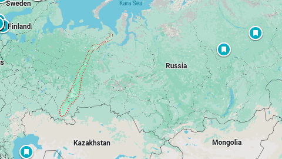
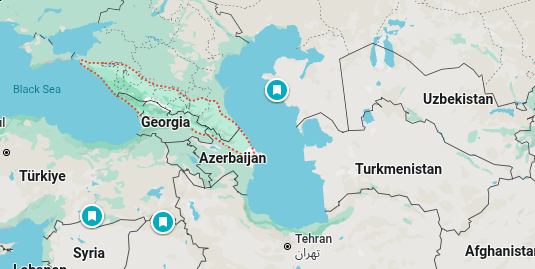

# Asia

* largest continent
* area : 44 million sq km
* ~ 30% of earth's land area
* ~ 8% of earth's surface area
* shares the landmass of `Eurasia`
* East -> `Pacific ocean` , south -> `Indian ocean` , north -> `Arctic Ocean`
* asia with europe border is cultural construct and not physical
* Geographical Asia largely reflects **European cultural ideas about the world**.
* Asia - Africa boundary
    * `Suez Canal`
    * `Gulf of Suez`
    * `Red Sea`
    * `Bab-el-Mandeb Strait`
* Asia - Europe boundary
    * `Turkish straits`
    * `Ural mountains` and `Ural River`
    * `Caucasus Mountains` ( `black sea` to `caspian sea`)
* Asia - Oceania boundary
    * ???
* Asia - North America boundary
    * ???
* China nd India -> largest economies in the world from 1 to 1800 CE.
* birthplace of the world's mainstream religions
    * `Buddhism, Christianity, Confucianism, Hinduism, Islam, Jainism, Judaism, Sikhism, Taoism, Zoroastrianism` and many more
---

> `Suez canal` is artificial built in 1800s

> Africa and Asia were connected by a narrow strip of land called the `Isthmus of Suez`

---

* Ural mountains

* Caucasus Mountains

---

### Etymology

* Bronze Age toponym `Assuwa` a place in `Anatolia` (modern day turkey) - appeared in `Hittite records`
* `Piny` was one of the first writer to use `Asia` as a name of whole continent.
* ???

---

### History
???

---