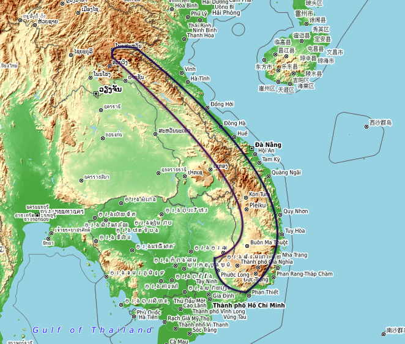
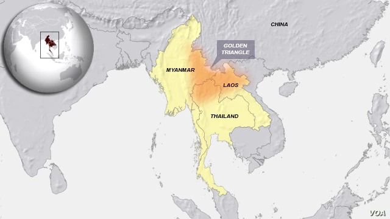

# Laos
* Lao People's Democratic Republic (LPDR)
* only landlocked country in Southeast Asia
* population : 75 lakh
* area `2,36,800` sq km
* capital : `Vientiane`
* 3 UNESCO world Heritage sites
    1. Luang Prabang
    2. Vat Phou
    3. Plain of Jars
* highest elevation : `Phou Bia` `2,818 m`
* `Annamite Range`

---

|||
|-|-|
| 13th to 18th | Kingdom of Lan Xang |
| 1707 | split into   1. Luang Prabang   2. Vientiane   3. Champasak |
| 1893 | unified again under French rule as part of `French Indochina` |
| world war II | under Japanese adminstration |
| 1949 | went back to French and achieved autonomy |
| 1953 | Kingdom of Laos, constitutional monarchy under Sisavang Vong |
| 1959 - 1975 | civil war |
| 1975 | LPDR |

---

### Etymology
* in Lao Llanguage colloquially called `Muang Lao` (Lao Country) or `Pathet Lao`
* `s` was inroduced by French while uniting
* Laotian or simply Lao for demonym
* various explanation for origin
    * pali word labu -> bottle guard -> myth from which humanity emerged
    * Tai-Lao tribes -> Kao Long (nine dragons) -> Luang -> Lao
    * folk -> Dao (star) -> Lao
    * Austroasiatic root -> *k.raw (human being or person)

---

### Geography
* forsted landscape consists mostly of mountains
* `Annamite Range`
* `Mekong River`
* `Luang Prabang Range`
* 2 major plateaous
    1. `Xiangkhoang`
    2. `Bolaven`
* one of three nations in the **opium poppy** growing region known as the `Golden Triangle`

#### Climate
* tropical savanna
    * hot throughout the year
    * has a wet season and dry season
    * lots of grass
    * scattered trees and not dense forests
* May to Oct -> rainy season
* Nov to Apr -> dry season

#### Wildlife

----

> divided into 17 provinces

---

### History
|||
|-|-|
| 46000 years old | skull found in `Tam Pa Ling Cave` in Annamie mountians |
| 4th millennium BCE | agricultural society |
| 1500 BCE | bronze artifacts |
| 700 BCE | iron tools |
|8th and 10th centuries | Tai-speaking groups migrated from `Guangxi` |
???

---
