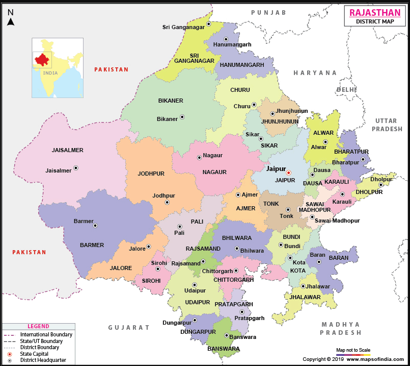
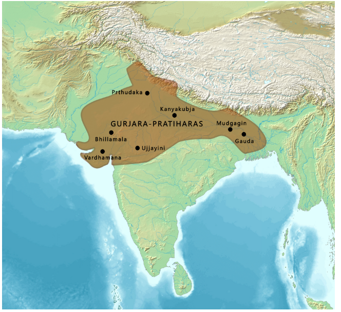

# Rajasthan

## Stats
* Area 3,42,239 sq Km (10.4% of india) - largest
* Population 78.2 lakhs - 7th largest
* Elevation from `100m` to `1,722 m`
* Guru Sikhar -> highest point of the Aravalli Range (1,722 m)
* `Capital` : **Jaipur** - largest city of Rajasthan
* oldest reference to Rajasthan in a stone inscription back to `625CE`
* HDI -> 22 (0.652)

## Tourism
* `only hill station` - **Mount Abu**

## district map
* Districts : 41
* DIvisions : 7

## Links
* [foundation.rajasthan.gov.in](https://foundation.rajasthan.gov.in/rf/index.html)

---

#### major features
* **thar** desert
* **Indus valley** civilization -> **Kalibangan** and **Balathal**
* **Dilwara Temples**
* `3 tiger reserves`
    * **Ranthambore National Park**
    * **Sariska Tiger Reserve**
    * **Mukundara Hills National Park**

---

## Etymology
* stone inscription -> `625 CE`
* first printed mention on name rajasthan -> `1829`
* earliest name of region as **`Rajputana`** -> `1800`
    * coined by British in `1829`

---

## History
### Ancient times
|desc|period|
|-|-|
| part of **Vedic civilization**()   * `Matsya Kingdom` - **Jaipur** and **Alwar** with portion of **Bharatpur**   * capital of Matsya was **Viratanagar**(**Bairat**)   * `Pandavas` spent a year in concealment during their exile  |`1500-500 BCE`|
| part of **Indus Valley civilization**  **Kalibangan** in **Hanumangarh district** -> major provincial capital of indus | `3300-1300 BCE` |
| archaeological excavation at **Balathal** in **Udaipur district** shows **Harrapan civilization** | `3000-1500 BCE` |
| **stone age** tools found in **Bundi** and **Bhilwara** | `5000-200,000` years |
| `rajputs` first entered India from north west | first millennium AD |
| Western Satraps + Saka rulers + Kushan Empire | 405-35 BCE - 375 CE |

### Classical era
|||
|-|-|
| गुर्जर-प्रतिहार (Gurjar Pratihar Empire)| upto 10th century CE   seat of power at Kannauj   region was known as Gurjaratra / Gurjaradesa   acted as barrier for Arab invaders from 8th to 11th century |

Extent of the Pratihara Empire at its peak 800-950 CE

### Medieval and early modern eras
???

### Modern era
* 30 March 1949 -> State of Rajasthan
---

## Geography
???

---

## Flora and fauna
???

---

## Governance and administration
???

---

## Communication
???

---

## Economy
???

---

## Transportation
???

---

## Demographics
???

---

## Culture
???

---

## Education
???

---

## Tourism

* Udaipur
    * founded in 1533 by Maharana Udai Singh

    Fateh Sagar Lake is a charming lake surrounded by hills and woods. This artificial lake was constructed by Maharana Jai Singh in 1678 AD and it lies north of Lake Pichola. It was later reconstructed during the reign of Maharana Fateh Singh (1884-1930 AD) after the earthen bund (dam) was washed away in floods. The Maharana built Connaught Dam to commemorate the visit of the Duke of Connaught and the lake was renamed Fateh Sagar Lake. Fateh Sagar Lake is one of the four lakes in Udaipur and it houses three small islands. The largest among them, the beautiful Nehru Island, is popular with tourists; the second island has a public park and a spectacular water-jet fountain; the third island is home to the Udaipur Solar Observatory. All the islands can be visited by motorboats. The calm, blue surface of the lake set against the green mountains make Udaipur India’s ‘second Kashmir’.

    The city of Udaipur has five prominent lakes, one of which is the Udaisagar Lake. Located about 13 kilometres to the east of the city, the lake was created during the reign of Maharana Udai Singh. In 1559, the Maharana commissioned the construction of a dam on Berach River to meets the demands of water in his kingdom. Udaisagar Lake is the outcome of this dam. In 1573, Kunwar Man Singh invited Maharana Pratap Singh to the banks of Udaisagar Lake. He wished to discuss the terms of surrender that the Mughal Emperor Akbar has put forth. Maharana Pratap Singh declined the invitation and history says that he even insulted Man Singh. This event sparked the Battle of Haldighati three years later, in 1576. Many years later, Maharana Raj Singh defeated and conquered the army of Emperor Aurangzeb near Udaisagar Lake. Today, it is a weekend destination for the locals and the calm waters of the lake also attract tourists.

    he road that takes visitors to Pichola Lake has another popular destination – the Doodh Talai Lake. The lake is nestled between several small hillocks which themselves are tourist attractions. The Deen Dayal Upadhyay Park and the Manikya Lal Verma Garden are part of the Doodh Talai Lake Garden. The Manikya Lal Verma Garden gives an amazing view of Lake Pichola and Doodh Talai Lake. It is among the more recent attractions and was built in 1995 by the Nagar Parhisad (Municipal Council) of Udaipur. One can reach the top by climbing steps or by driving up. Locals often go up the hillock to the Karni Mata Temple that houses a white stone idol of the goddess. Deen Dayal Upadhyaya Park is a small garden on the adjacent hillock, developed by the Urban Improvement Trust (UIT) of Udaipur. Its highlight is Rajasthan’s first musical fountain, a popular attraction among the locals and visitors as well. The garden overlooks Lake Pichola and offers a spectacular view of sunset to visitors. A ropeway connects the tops of these two hillocks and takes tourists to the Karni Mata temple. This 4-minute ride is Rajasthan’s first ropeway and offers a panoramic view of the city.

|||
|-|-|
| Ajmer | * Ajay Meru -> invincible hill   * Khwaja Moinuddin Hasan Chisti   * founded Raja Ajaypal Chauhan in 7th century AD   * Chauhan Dynasty till 12th century AD   * after defeat of Prithviraj Chauhan by Mohammed Ghori in 1192 , no of dynasties   * Jahangir court first meeting with Ambassador of King James 1 of England in 1616   * handed over to British , only region in Rajputana to be directly controlled by British|

---

# todo
* maps of dynasties in the location with time ???

---