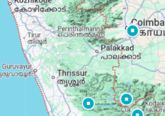
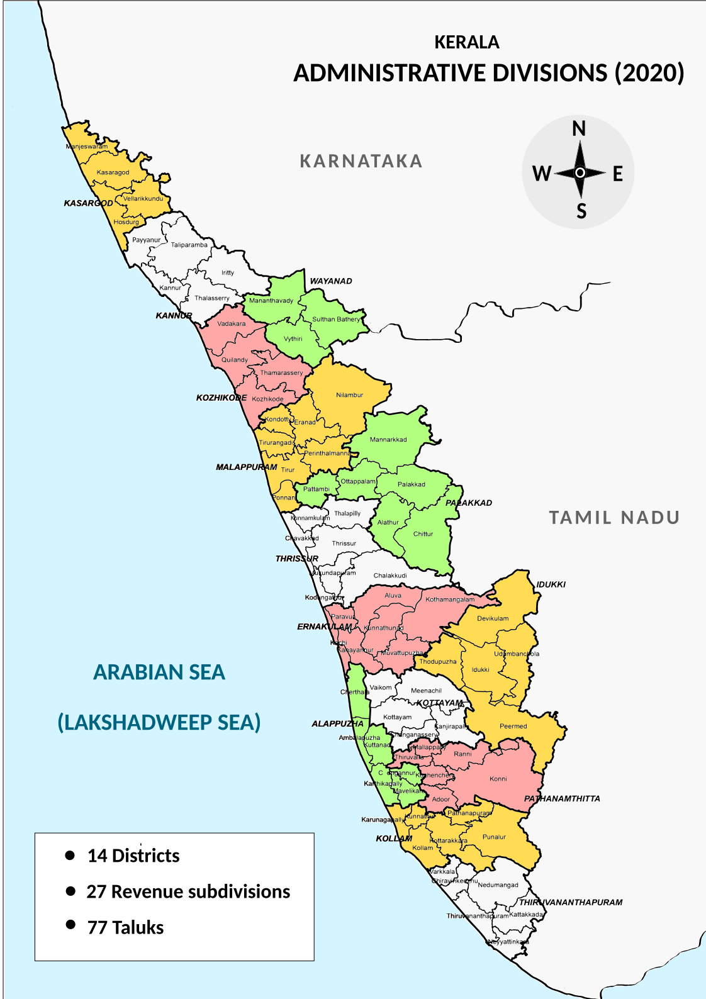
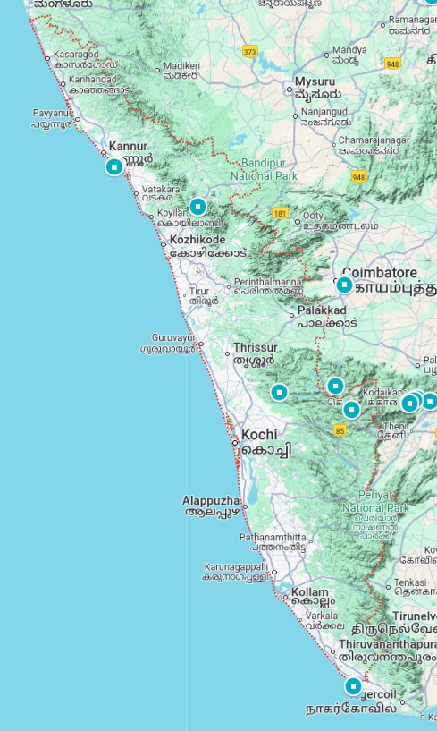

# Kerala

## Stats
* Area 38,863 km²
* Population 3.46 Crore 2018
* 595km coast - Arabian Sea shoreline
* Capital : `Thiruvananthapuram`
* Most Widely spoken language : Malayalam
* Arabian Sea to the west and Western Ghats to the east
* **`Anamudi`** -- `highest elevation` - 2695 m (highest in south india)
* **`kuttanad`** -- `lowest altitude in India` - -2.7m
* **`Vembanad`** -- `longest lake in India` - length of 96.5 km - area 230 km²
* **`Idukki Dam`** - `world's second arch dam`

---
* keralam in Malayalam
* state on the Malabar Coast of India
* formed in 1 nov 1956
    * combining Malayalam speaking regions of Cochin, Malabar, South Canara and Travancore
* Prominent Kingdom
    * Chera dynasty - 200 BCE - 1100 CE
    * Ay dynasty - 100 CE - 1000 CE
    * Mushika (Ezhimala) dynasty - ??? - 1100 CE
* spice exporter - since 3000 BCE
* region's prominence in trade (100 CE) was noted in
    * works of Pliny - roman author (23CE-79CE)
    * Periplus of Erythraean sea - logbook recording sailing
* 15th century, spice trade attracted Portuguese trades to Kerala
    * paved the way for European colonisation of India
* Norhern Kerala - part of Madras province of British India
* at time of Indian Independence movement in the early 20th century
    * there were two major princely states
        * Travancore
        * Cochin
    * these states united to form state of Thiru-Kochi in 1949
* Kerala was formed by merging
    * Malabar distict of Madras State
        * excluding
            * Gudalur taluk of Niligris district
            * Lakshadweep Islands
            * Topslip
            * Attappadi Forest east of Anakatti
    * taluk of Kasaragod in South Canara
    * state of Thiru-Kochi
        * excluding
            * 4 southern taluks od Kanyakumari district
            * Shenkottai taluks

> taluk : an administrative district for taxation purposes, typically comprising a number of villages

---

* lowest positive population growth in India , 3.44%
* highest Development Index , 0.784 2018
* highest literacy rate , 96.2% 2018
* highest life expectancy 77.3 years
* highest sex ratio , 1084 women per 1000 men
* second least impoverished state , after goa 0.48% population below poverty
* second most urbanised major state
* Hinduism  - more than 50% population
    * then Islam , and then Christianity

---
* 8th leargest economy in India - 110 billion USD GDP
    * primay sector - 8% states' GSVA
    * tertiary sector - 65% states' GSVA

> GSVA  Gross value added : measure of values of good and services produced in an area

> three sector model of economy ->
> 1. primary sector (raw materials)
> 2. secondary sector (manufacturing)
> 3. Tertiary sector (service sector)

---
* witnessed significant emigration from 1972 to 1983
    * to Arab states of the Persian Gulf during **Gulf Bloom**
* continues to the present day
    * in smaller number after 2008 international financial crisis
* GCC states - Keralite population of more than 35 lakhs
* sent home 6.84 billion USD (more than 15% of total remittance to India in 2008)
* Kerala economy depends significantly on remittances from a large Malayali expatriate commnunity

---
* production

||share of India| year| |
|-|-|-|-|
|pepper | 32% | 2021-22 | second highest, after karnataka|
| natural rubber |  75% | 2018-19 ||
| Coconut | 24% | 2021-22 | 3rd after Karnatka and Tamil Nadu |
| Tea |4.5%|2021-22 | at 4th after Assam, West Bangal, Tamil Nadu |
|coffee | 21% || 2nd after Karanatka (71%) |
|cashew | 10% | 2021-22 | 6th after Maharashtra, Andhra Pradesh, Orissa, Karanatka, Tamil Nadu |

> Kodagu (Karanatka district)alone produces 33% of India's coffee

---

* 11 lakhs people dependent og fishery
    * contributes 3% to the state's income

---

* Named as one of the ten paradises of the world by National Geographic Traveler

---
---

## Etymology
* word Kerala first recorded as Keralaputo (son of Chera) in Edicts of Ashoka (3rd century)
* at that time, one of three states in the region was called `Cheralam`
    * in Classical Tamil , Chera and Kera are variants of the same word
* Cheral refers to oldest known dynasty of Kerala kings
    * derived from Proto-Tamil-Malayalam word for lake
* cherive-alam (tamil) -> declivity of a hill or a mountain slope

> Edicts of Ashoka : are a collection of more than thirty inscriptions on the Pillars of Ashoka

> edict : an offical order or statement issued by somebody in a position of power

---
* Malayalam word
    * `kera` -> coconut tree
    * `alam` -> land
    * thus land of coconuts

---
* `Aitareya Aranyaka` earliest sanskrit text to mention Kerala
    * as **`Cherapadha`**
* Kerala is also mentioned in Ramayana and Mahabharata
* Greco Roman trade map Periplus Maris Erythraei refers Kerala as Celobotra

> Aranyakas : part of Vedas concerned with meaning of ritual sacrifice

> Skanda Purana : largest Mukhyapurana , a genre of eighteen Hindi religious texts

> Murugan in South India refers to Kartikeya son of Shiva and Parvati
---

* Also alternatively called `Malabar` in foreign trade circles
* `Malabar` used to refer Tulu Nadu and Kanyakumari too
* until east india company
    * term Malabar was used as general name for Kerala, along the term Kerala
* From the time of Cosmas Indicopleustes
    * Arab sailors used to call Kerala as Male
    * `Male` -> pepper emporium
    * Malabar -> country of Male
* According to William Logan
    * `Male` -> Malayalam word (hill)
    * `Barr` -> Persian word (coiuntry)

* Al-Buruni (973-1048CE) is the first known writer to call this country Malabar

> Cosmas Indicopleustes : merchant and later hermit from Alexandria in Egypt , 6th century, made several voyages to India

> hermit : a person who prefers to live alone, without contact with other people

---

## History
???
---

## Geography

* humid tropical rainforest climate with some cyclones
* can be divided into three climatically distinct regions
    1. eastern highlands -- rugged and cool mountainous terrain
    2. central mid-lands -- rolling hills
    3. western lowlands -- coastal plains
* 1341 CE catastrophic flood reshaped Kerala
* 44 rivers
    * 41 west-flowing
    * 3 east-flowing
* rivers are small
* all rivers are monsoon-fed
* rivers
    * Periyar - 244 km
    * Bharathapuzha - 209 km
    * Pamba - 176 km
    * Chaliyar - 169 km
    * ...
* Western Ghats form a mountain wall, interrupted at **Palakkad** called **Palghat Gap**

* **Anamudi** - highest peak in south India - 2,695 m
* chain's forests are considered to be older than the Himalaya mountains
* Wayanad is the **sole Plateau** in Kerala
* Minerals including Ilmenite, Monazite, Thorium, and Titanium, are found in the coastal belt of Kerala
* Karunagappally coastal belt --- high background radiation from thorium-containing monazite san --- >4 mGy/yr - 70 mGy/yr
* **Kuttanad** -- Rice Bowl of Kerala -- lowest altitude in India - -2.7m
* **Vembanad** -- longest lake in India - length of 96.5 km - area 230 sq km
* 120-140 rainy days per year
* June to August - 65% rain , rest in sep - dec
* first state to receive rain from Southwest monsoon
* rainfall 2,923 mm avg annually
* Idukki district 5,000 mm

### Flora and fauna
???

---

---

## Divisions, districts and cities
* 
???

---

## Government and administration
???

---

## Economy
???

---

## Transportation
???

---

## Demographics
???

---

## Education
???

---

## Culture
???

---

## Media
???

---

## Sports
???

---

## Tourism

 * National Geographic's Traveller magazine 2012
    * 10 paradises of the world
    * 50 must see destinations of a lifetime
* Travel and Leisure
    * One of the 100 great trips for the 21st century
* Google's search trend 2012
    * it overtook the Taj Mahal in India
* CNN Travel 2019
    * 19 best places to visit
* TIME magazine 2022
    * 50 extraordinary destinations in World's Greatest Places
* BBC 2016
    *  **`Muzhappilangad`** - top six drive-in beach in world

---
---
---

## Tourism

* Ayurveda
* https://en.wikipedia.org/wiki/Beaches_in_Kerala
* https://en.wikipedia.org/wiki/Kerala_backwaters
* Airports
    * Kannur CNN
    * Calicut CCJ
    * Cochin COK
    * Trivandrum TRV

* **`Athirappilly Falls`** - Chalakudy River - largest waterfall in the state
* **`Muzhappilangad`** - only drive-in beach in the state
* **`Idukki Dam`** - world's second arch dam

The major beaches are at Kovalam, Varkala, Kozhikode, Fort Kochi, Cherai, Alappuzha, Ponnani, Kadalundi, Tanur, Chaliyam, Payyambalam, Kappad, Muzhappilangad and Bekal. Popular hill stations are at Ponmudi, Wayanad, Vagamon, Munnar, Peermade, Ramakkalmedu, Arimbra, Paithalmala of Kannur district, Kodikuthimala, and Nelliampathi.[623] Munnar is 4,500 feet above sea level and is known for tea plantations, and a variety of flora and fauna.[624] Kerala's ecotourism destinations include 12 wildlife sanctuaries and two national parks: Periyar Tiger Reserve, Parambikulam Wildlife Sanctuary, Chinnar Wildlife Sanctuary, Thattekad Bird Sanctuary, Wayanad Wildlife Sanctuary, Kadalundi Bird Sanctuary, Karimpuzha Wildlife Sanctuary, Muthanga Wildlife Sanctuary, Aralam Wildlife Sanctuary, Eravikulam National Park, and Silent Valley National Park are the most popular among them.[625] The Kerala backwaters are an extensive network of interlocking rivers (41 west-flowing rivers), lakes, and canals that centre around Alleppey, Kumarakom, Ponnani, Nileshwaram, and Punnamada (where the annual Nehru Trophy Boat Race is held in August), Pathiramanal a small island in Muhamma. Padmanabhapuram Palace and the Mattancherry Palace are two nearby heritage sites.[626][627]
