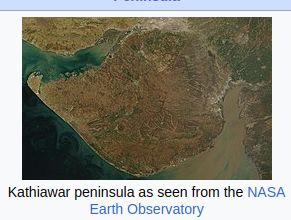

## Stats
* 1600 km coastline, longest in the country
* Area 1,96,024 km²
* Population 7.07 Crore
* Capital: Gandhinagar
* Largest City - Ahmedabad
* Official language: Gujarati
* 23 sites of Indus Valley civilization - maximum in any other state
    * Lothal - world's first dry dock
    * Dholavira - fifth largest site
    * Gola Dhoro - 5 uncommon seals were found
---

* Gujarat is derived from Gurjar who ruled Gujarat in 8th and 9th centuries CE

---

