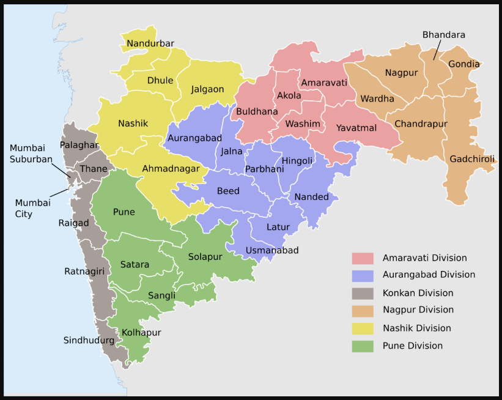
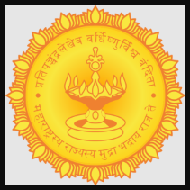
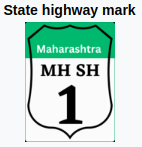
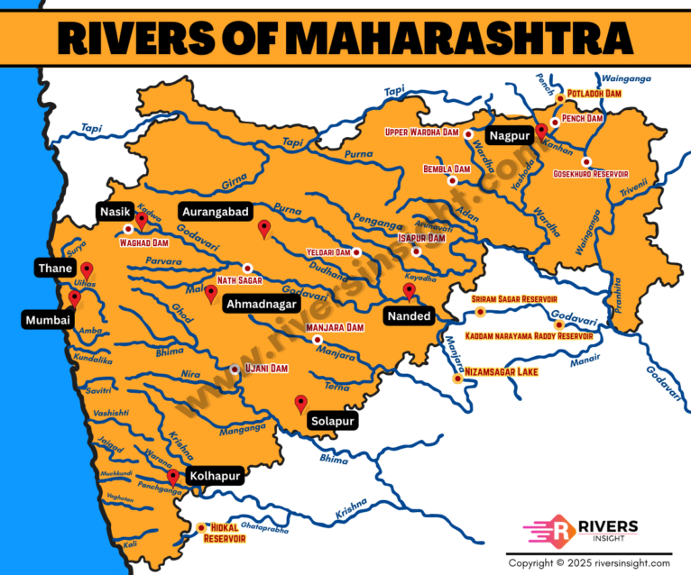

# Maharashtra

## Stats
* **2nd** most populous state in India
* **4th** most populous first-level administrative divisions global
* area : 307,713 sq km
* coastline : 840 km
* capital : **Mumbai** , winter capital : **Nagpur**
* `mumbai`
    * most populous urban area in India
    * financial and commerical capital of India
* main rivers : **Godavari** and **Krishna**
* forest covers 16.47% area
* highest elevation: Kalsubai Peak : 1646 m
* UNESCO world heritage sites:
    1. `Ajanta Caves`
    2. `Ellora Caves`
    3. `Elephanta Caves`
    4. `Chhatrapati Shivaji Terminus` (formerly `Victoria Terminus`)
    5. `the Victorian Gothic and Art Deco Ensembles of Mumbai`
    6. `the Western Ghats`
* agriculture accounts for 12% of GDP but employs ~50% of the population

---

|Notable dynasties||
|-|-|
|700BC - 345BC |Asmakas|
|320 BC - 185 BC | Mauryas
|late 2nd century BC - 224 CE |Satavahanas
|35 - 415 CE| Western Satraps
|203-370 |Abhiras
|250-510 |Vakatakas
|543-753 |Chalukyas
|753-982 |Rashtrakutas
|957-1184 |Western Chalukyas
|850-1317 |Seuna Yadavas
|1290-1320 |Khaljis
|1320-1413 |Tughlaqs
|1347-1527 |Bahamanis
|1526-1857 |Mughals
|early 19th century |Dominions of the Peshwa in the Maratha Confederacy and Nizamate of Hyderabad
||British rule : Bombay Province, Bearer Province, Central Provinces
|1950-1956 | Bombay state on Indian Union
|1 May 1960 | Bombay state splited into Maharasthra and Gujrat
---
## division/map

---

## Etymology

???

---

## History

???

---

|||
|-|-|
|state emblem|  |
| state highway mark | 

---

## Geography

* west to east ::::> `konkan coastline` (50-80 km width) : `western ghats` : `flat deccan plateau`
* north : `Satpura Hills`
* north - south : 720 km
* east to west : 800 km
* rivers : `Krishna` `Bhima` `Godavari` `Manjara` `Wardha-Wainganga` `Tapi` `Purna`

> western ghats also known as **`Sahyadri`** sanskrit -> saha : benevolent and adri : mountain

* limited area under irigation , low agricultulral prodictivity as compared to national average

* geographical regions
    * Khandesh - north maharashtra
    * konkan
    * Marathwada
    * Vidarbha
    * Desh

#### climate
???

#### flora and fauna
???

Misal Pav: A spicy curry topped with farsan and served with bread, this dish is a Pune favorite.
Bhakarwadi: A crispy snack filled with a spicy and tangy mix.
Puran Poli: A sweet flatbread stuffed with jaggery and lentils, often enjoyed during festivals.
Vada Pav: Known as the Indian burger, it’s a quick and tasty snack.
Mastani: A rich milkshake topped with dry fruits and ice cream, originating from Pune.
